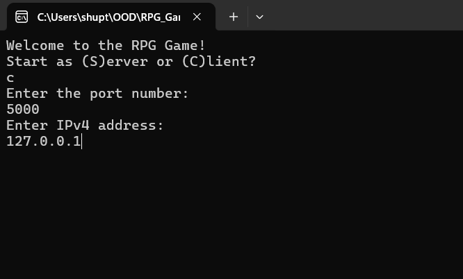

# Console RPG Game
**Note:** in order to test the most up-to-date version of the game clone the `dev` branch.

This project is a console-based multiplayer RPG developed as part of the Object-Oriented Design course.  
The main purpose of the project is to apply solid object-oriented principles and design patterns to build maintainable, reusable, and easily extensible software.  
The game demonstrates the use of networking, real-time updates, and MVC architecture in a simple but functional environment.

---

## Recommended environment:

The game is designed specifically for `Windows PowerShell`, as other consoles  may not fully support the rendering features used in the View as they use Console object, which is not well-supported in other environments.

---

## Overview

The program allows a user to act as both a server and a client at the same time. The server maintains the authoritative game state and updates it at a specific tickrate.  
All communication is handled over the TCP/IP protocol, allowing multiple clients to connect to the same host and synchronize their state with the server.  

Each instance of the program can either:
- start as a **server**, hosting the game world and listening for incoming connections, or  
- connect as a **client**, joining an existing session and rendering the shared maze view.
- or both at the same time.

The system is implemented using the **Model–View–Controller (MVC)** pattern, which provides a clear separation between the game logic, user input handling, and rendering.  
This structure makes the codebase easy to test, maintain, and extend with new features.

---

## Networking and Game Loop

The networking layer is built on top of the **TCP/IP** protocol.  
When a user runs the game in server mode, the application starts a TCP listener on the chosen port. Clients can then connect by specifying the host IP and the same port number.  
Each update cycle is governed by the server’s **tickrate**, which defines how frequently the game state is updated and broadcasted to clients.  
This allows the game to maintain consistent state synchronization between multiple connected players.

---

## How to run
Compile and run a program in a `Windows Powershell`. First, you would be prompted where you want to act as a server or client - specifying the first letter suffices to make a choice, then the program would ask you to enter the port number in case of a server, or an IP address and port number in case of a client. After successful connection, or server setup - the maze should be rendered.

**Note:** The program assumes the default `localhost` address for hosting the server.

Below I attach how the prompt windows should look like:

### Server Prompt menu:

### Client Prompt menu:

---

## 🎮 Controls Overview

Below is the full list of available controls for **client mode** (players).  
All controls are **case-insensitive** and designed for intuitive gameplay.

| **Key** | **Modifier** | **Action** | **Description**                                         |
|----------|---------------|------------|---------------------------------------------------------|
| **W** | — | Move Up | Moves your character upward in the maze.                |
| **A** | — | Move Left | Moves your character to the left.                       |
| **S** | — | Move Down | Moves your character downward.                          |
| **D** | — | Move Right | Moves your character to the right.                      |
| **E** | — | Pick Up Item | Picks up an item located on your current tile.          |
| **G** | — | Drop Item | Drops the currently selected item.                      |
| **Ctrl + G** | Ctrl | Empty Inventory | Drops all items currently held in your inventory.       |
| **Q** | — | Equip Item | Equips the currently selected item from your inventory. |
| **U** | — | Use Item | Uses the currently selected item (e.g., potion, scroll). |
| **H** | — | Scope Hands | Allows navigating the hands with arrows                 |
| **I** | — | Scope Inventory | Allows navigating the inventory with arrows             |
| **Esc** | — | Scope Room | Allows to return to the default room scope              |
| **Left Arrow** | — | Previous Item | Selects the previous item in your scope.                |
| **Right Arrow** | — | Next Item | Selects the next item in your scope.                    |
| **1** | — | Normal Attack | Performs a standard attack with your equipped weapon.   |
| **2** | — | Stealth Attack | Performs a sneak attack  |
| **3** | — | Magic Attack | Magic-based attack                                      |
| **Spacebar** | — | One-Weapon Attack | Performs a single weapon attack                         |
| **Shift + Spacebar** | Shift | Two-Weapon Attack | Performs a dual-weapon                                  |
| **X** | — | Quit Game | Disconnects from the session and exits the game.        |

**Note:** different types of attacks deals different damage values based on your attributes and weapons used, as well as the weapons and attributes of your enemy.

---

## Functionalities to be added:
- Hosting the app in public network.
- Ability for the client to see the controls for the game and potentially configure them
- Implement the action of death of the player and handle the disconnection from the game.